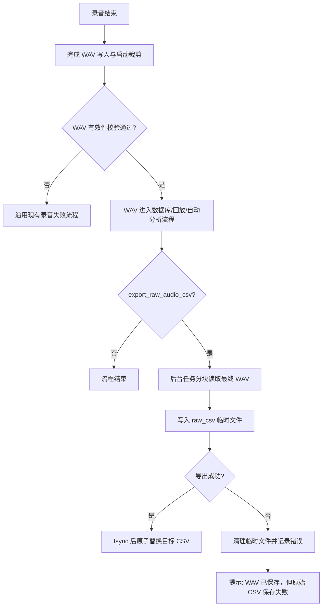

# 原始音频 WAV/CSV 可配置保存方案

## 1. 目的

在产品测试项目配置中增加“原始音频保存”选项，使用户可以按项目选择：

- `仅 WAV`
- `WAV + CSV`

WAV 始终是录音主文件。选择 `WAV + CSV` 时，在 WAV 完成裁剪和有效性校验后，额外导出一份与最终 WAV 内容对应的原始采样 CSV。

## 2. 范围与约束

本次改动覆盖项目配置、配置界面、原始音频 CSV 导出、录音完成流程和自动化测试。

本次不改变以下现有行为：

- 不提供“仅 CSV”模式。
- 数据库中的录音路径仍指向 WAV。
- 自动分析、录音回放和报告生成仍以 WAV 为输入。
- 分析结果 CSV 的目录结构和文件格式保持不变。
- 不将原始数字采样值换算为 Pa、SPL 或其他校准量。

## 3. 配置设计

项目配置新增布尔字段：

```json
{
  "export_raw_audio_csv": false
}
```

字段语义如下：

| 配置值 | 界面选项 | 保存行为 |
| --- | --- | --- |
| `false` | 仅 WAV | 只保存 WAV |
| `true` | WAV + CSV | 保存 WAV，并异步导出原始采样 CSV |

旧项目配置缺少该字段时按 `false` 处理，保持原有行为。该配置属于项目级配置，对项目内所有端口和工况生效。

## 4. 界面设计

在“测试结果保存”区域的保存目录下方增加一行：

```text
原始音频保存：  ● 仅 WAV    ○ WAV + CSV
```

两个选项使用互斥单选按钮，并在同一行显示。界面不增加“推荐”等补充文字。

## 5. 存储目录与命名

原始音频统一放在样本目录下的 `audio` 中，按格式分为 `wav` 和 `raw_csv`：

```text
<结果根目录>/
└─ <项目>/
   └─ <型号>/
      └─ <样本>/
         ├─ audio/
         │  ├─ wav/
         │  │  └─ <recording_stem>.wav
         │  └─ raw_csv/
         │     └─ <recording_stem>.csv
         ├─ csv/
         │  └─ <recording_stem>/
         │     └─ <现有分析结果 CSV>
         └─ images/
```

原始 CSV 与 WAV 使用相同文件名主干。`raw_csv` 仅在启用导出且实际执行导出时创建。

该结构将原始采样 CSV 与分析结果 CSV 分开。已有 WAV、原始 CSV 和数据库路径不迁移、不删除；新录音使用新结构。

提交边界：本功能不包含尚未提交的手动报告导出模块。该模块后续合入时，需一并包含对新 `audio/wav/` 和旧 `wav/` 的扫描兼容，分析结果仍读取 `csv/<recording_stem>/`；对应实现和测试已随报告模块保留在迁移前的 stash 中。

## 6. CSV 数据契约

CSV 表头格式：

```text
sample_index,time_s,CH1,CH3,...
```

字段定义：

| 字段 | 定义 |
| --- | --- |
| `sample_index` | 从 0 开始的采样点序号 |
| `time_s` | `sample_index / sample_rate`，单位为秒，保留 9 位小数 |
| `CHn` | 最终 WAV 中对应物理录音通道的归一化数字采样值 |

数据规则：

- CSV 数据来源为已经完成启动裁剪并通过有效性校验的最终 WAV。
- 多通道数据逐通道导出，不做单声道合并。
- 通道标题保留实际物理通道标识，允许出现 `CH1、CH3` 等不连续编号。
- 采样值按 9 位有效数字输出，目标是与 WAV 中保存的 `float32` 数字样本一致。
- 文件编码使用 `UTF-8-SIG`，便于直接使用常见表格软件打开。
- 大文件按数据块读取和写入，避免一次性复制整段录音数据。

## 7. 保存流程



原始 CSV 导出不阻塞 Qt 主线程，也不延迟数据库记录、回放和自动分析。后台任务通过 Qt 排队信号回到主线程显示结果，避免工作线程直接操作界面。

## 8. 一致性与失败策略

- CSV 只从最终 WAV 读取，确保裁剪结果、通道数和实际保存样本保持一致。
- 导出采用“同目录临时文件 + 刷盘 + 原子替换”，成功前不暴露不完整目标文件。
- 同一 WAV 的重试使用相同目标路径，可以安全替换旧文件，不生成独立序号。
- CSV 导出失败不删除 WAV，不回滚数据库记录，不阻断自动分析、回放或 OK/NG 流程。
- 导出失败必须写入日志，并在主界面提示“WAV 已保存，但原始 CSV 保存失败”。
- 后台导出线程需持有任务所需的独立参数，完成后释放运行时引用。
- 程序退出时复用现有“正在保存”流程，等待已经启动的原始 CSV 导出完成，避免导出任务被截断。

## 9. 代码改动范围

预计涉及以下职责：

| 模块 | 改动职责 |
| --- | --- |
| 项目配置常量与管理器 | 新字段、默认值、旧配置兼容和规范化 |
| 产品测试项目配置界面 | 同行单选项的加载与保存 |
| 项目运行上下文 | 将导出开关传递给录音完成流程 |
| 路径模块 | 生成 `audio/wav/<recording_stem>.wav` 和 `audio/raw_csv/<recording_stem>.csv` 路径 |
| 原始 CSV 导出器 | 分块读取 WAV、格式化、临时文件和原子替换 |
| 录音完成流程 | 在最终 WAV 校验后调度后台导出并处理失败提示 |
| 自动化测试 | 配置兼容、界面绑定、路径、CSV 内容、原子失败和流程分支 |

## 10. 验收标准

1. 新项目和旧项目默认选中“仅 WAV”。
2. 保存并重新打开项目后，界面选项与 JSON 配置一致。
3. “仅 WAV”模式不创建 `audio/raw_csv`。
4. “WAV + CSV”模式在最终 WAV 校验通过后生成同名 CSV。
5. 单通道和非连续物理通道的多通道 CSV 表头、时间列和样本值正确。
6. 原始 CSV 不出现在现有分析结果或报告数据源中。
7. CSV 导出失败时 WAV、数据库记录、自动分析和回放不受影响，并有日志与用户提示。
8. 相关单元测试、语法检查和差异检查通过；实际界面布局和长时间录音性能仍需在真实环境中验收。
