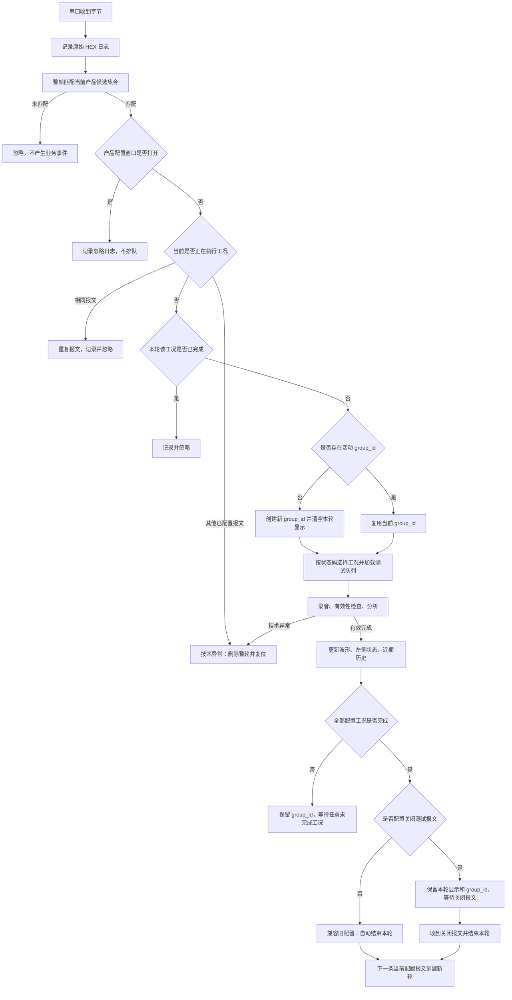

# 串口完整报文触发产品多工况测试设计

## 1. 文档状态

- 设计范围：串口主动上报完整报文，触发产品多工况录音与分析。
- 当前方案：按当前激活产品配置匹配，工况可按工装实际到达顺序执行。
- 协议边界：无开始码、无 ACK、PC 不轮询；支持产品级“关闭测试报文”。
- 匹配模式：仅支持完整十六进制报文匹配；CRC 字节包含在报文中一并匹配。
- 实施状态：软件逻辑及自动化测试已覆盖；真实工装、声卡和连续多轮联调仍需现场验收。

## 2. 目标

工装主动发送某一转速对应的完整串口报文后，软件应在当前激活的产品测试配置中查找对应工况，加载该工况的测试队列，执行录音与分析，并把波形、工况状态和近期历史写入正确的工况位置。

系统不要求工装按产品配置表的排列顺序发送。配置表顺序只决定界面列顺序及本轮必须完成的工况集合，实际录音顺序由合法状态码的到达顺序决定。

## 3. 已确认业务规则

1. 工装主动上报，PC 只监听，不发送查询命令。
2. PC 不回复 ACK。
3. 不配置或识别开始状态码；可在产品配置中设置一个产品级“关闭测试报文”。
4. 状态码使用完整十六进制报文精确匹配。
5. CRC 字节作为完整报文的一部分参与匹配，首版不独立计算 CRC。
6. 只接受当前激活产品测试配置中的报文。
7. 当前配置外的串口数据只记录原始接收日志，不触发录音、不创建轮次、不弹窗。
8. 当前无活动轮次时，收到当前配置中的任意工况报文均可创建新轮次。
9. 同一轮内，尚未完成的任意工况均可按报文到达顺序执行。
10. 同一工况在当前轮有效完成后，再次收到相同报文时忽略，不重复测试。
11. 当前工况正在录音或分析时，重复收到相同报文时忽略。
12. 当前工况正在执行时收到另一个已配置工况报文，视为工装切换过快或运行冲突，整轮按技术异常处理。
13. `OK` 和 `NG` 都是有效业务结果，均表示该工况已完成。
14. 测试队列未配置阈值或 AI 判定能力时，录音和分析正常完成后记为“已完成、未判定”，不视为异常。
15. 录音无效、声卡失败、队列加载失败、分析异常、应判定但未产生有效结果、串口在活动轮次中断等属于技术异常。
16. 技术异常发生后立即删除当前 `group_id` 下的整轮近期历史、WAV 和数据库关联记录，并清空本轮界面状态。
17. 异常处理结束后不判断操作员是否重测，也不要求第一工况；系统直接等待当前配置中的下一条合法工况报文创建新轮次。
18. 配置了关闭测试报文时，全部工况完成后保留活动 `group_id`、波形、状态和近期历史，等待关闭报文结束本轮。
19. 活动轮次尚有未完成工况时收到关闭报文，删除该 `group_id` 下的整轮记录、清空本轮界面并提示操作员。
20. 无活动轮次时收到关闭报文，只记录日志并忽略；重复关闭不产生额外业务动作。
21. 未配置关闭测试报文的旧产品配置继续按“全部工况完成即自动结束本轮”运行。
22. 产品测试配置窗口打开期间，所有串口工况及关闭触发均忽略且不排队；关闭后仅新收到的报文有效。

## 4. 不在本期范围内

- 状态字节、单 bit、位掩码或字段级匹配。
- 开始码及其他显式产品周期协议。
- ACK、重发请求或工装握手。
- PC 主动轮询工装状态。
- 独立 CRC 算法计算及“CRC 错误”分类诊断。
- 根据用户是否准备重测维护额外的重测状态机。

## 5. 关键数据模型

每个产品工况至少包含以下运行字段：

| 字段 | 含义 |
|---|---|
| `condition_name` | 工况显示名称，例如 `6000 rpm` |
| `trigger_state` | 包含 CRC 的完整十六进制报文 |
| `test_queue` | 该工况使用的录音与分析队列 |
| `condition_key` | 运行时工况键；优先使用规范化后的 `trigger_state` |

示例：

```json
{
  "condition_name": "6000 rpm",
  "trigger_state": "01 04 02 00 01 78 F0",
  "test_queue": "S004-1_6000"
}
```

产品配置顶层可增加一个关闭测试报文：

```json
{
  "name": "S004-1",
  "close_trigger_state": "01 04 02 00 00 B9 30",
  "sub_configs": []
}
```

`close_trigger_state` 为空或缺失时使用旧版自动结轮逻辑；非空时必须是包含 CRC 的完整十六进制报文，且不得与任一工况 `trigger_state` 重复。

输入保存及运行前应完成以下校验：

- 去除首尾空白，允许字节间存在一个或多个空格；
- 统一转为大写、双字符字节格式；
- 必须为偶数个十六进制字符且至少两个字节；
- 当前产品内完整报文不得重复；
- `test_queue` 必须存在且可加载；
- 串口自动触发不允许使用 `IMPORT_AUDIO` 队列。

## 6. 模块职责

| 模块 | 职责 |
|---|---|
| `base/hardware_trigger/serial_discrete_input_worker.py` | 被动读取串口字节；不轮询；记录原始接收日志；向整帧匹配器送入字节流 |
| `base/hardware_trigger/serial_full_frame_matcher.py` | 在半包、粘包和噪声字节中识别当前候选完整报文 |
| `base/unified_hid_device_manager.py` | 转发已匹配的产品完整报文事件，不映射为旧 `forward/reverse` |
| `ui/sequence/sequence_widget_serial_trigger_ops.py` | 校验当前产品、选择工况、处理重复/并发报文、异常整轮清理及串口状态 |
| `ui/sequence/sequence_widget_analysis_ops.py` | 创建和维持 `group_id`、加载工况队列、维护已完成集合、完成整轮 |
| `ui/sequence/sequence_widget_streaming_ops.py` | 录音、波形缓存、无效录音处理及录音结束后的分析入口 |
| `ui/sequence/recent_session_panel.py` | 按 `group_id` 聚合同一轮，并按 `condition_key` 展示各工况结果和分析入口 |
| `base/recording_management.py` | 同步删除 WAV 与 SQLite 记录；WAV 已缺失时仍清理数据库记录 |

串口层只负责识别“收到哪个当前配置工况”。轮次创建、完成集合和结束条件由现有产品测试运行状态统一维护，不新增第二套串口专用轮次状态机。

## 7. 串口接收与整帧匹配

### 7.1 被动接收

产品完整报文模式下，串口线程的查询命令固定为空。线程每次读取当前可用字节，将原始字节以大写空格分隔 HEX 写入日志，再交给匹配器处理。

### 7.2 半包与粘包

串口读取边界不等于报文边界。例如一条 7 字节报文可能分两次到达，也可能两条报文一次到达。匹配器必须维护内部缓冲区：

- 半包：保留可能构成候选帧的后缀，等待后续字节；
- 粘包：依次输出每个完整候选帧；
- 噪声：丢弃不可能构成任何候选帧前缀的字节；
- 候选重叠：优先匹配完整候选，不把一条报文拆成多个业务事件。

### 7.3 CRC 边界

例如 `01 04 02 00 01 78 F0` 的 `78 F0` 随整条报文参与精确匹配。首版没有 CRC 多项式、覆盖范围和大小端协议依据，因此软件只能得出“整条报文与配置一致”，不能单独报告“CRC 计算正确”。

## 8. 轮次状态所有权

| 状态字段 | 作用 |
|---|---|
| `_manual_product_condition_group_id` | 当前活动产品轮次；空字符串表示没有活动轮次 |
| `_displayed_manual_product_condition_group_id` | 当前界面展示的最近轮次，活动轮结束后仍可保留用于显示 |
| `_manual_product_condition_completed_keys` | 当前轮已有效完成的工况集合 |
| `_manual_product_condition_index` | 当前被报文选中的配置行，仅用于加载对应工况，不代表轮次是否开始或是否结束 |
| `_active_product_condition_key` | 正在录音/分析的工况键 |
| `_serial_product_condition_executing` | 当前是否由串口触发工况执行 |
| `_serial_product_waiting_for_close` | 全部工况完成后是否正在等待关闭测试报文 |

`_manual_product_condition_index` 不再承担以下职责：

- 不以索引为 `0` 判断新轮开始；
- 不以索引回绕到 `0` 判断整轮结束；
- 不以索引非 `0` 判断存在活动轮次。

新轮创建条件只有一个：当前没有活动 `group_id`，且收到当前激活配置中的合法工况报文。

配置关闭测试报文时，整轮结束条件为：全部 `condition_key` 已进入完成集合，且随后收到关闭测试报文。未配置关闭测试报文时，全部工况完成后沿用旧版自动结轮行为。

## 9. 运行流程



## 10. 事件处理矩阵

| 当前状态 | 收到报文 | 处理 |
|---|---|---|
| 无活动轮次 | 当前配置任意工况 | 创建 `group_id` 并执行该工况 |
| 无活动轮次 | 当前配置外数据 | 记录原始日志并忽略 |
| 活动轮次、空闲 | 本轮未完成工况 | 复用 `group_id` 并执行 |
| 活动轮次、空闲 | 本轮已完成工况 | 记录重复完成日志并忽略 |
| 工况执行中 | 当前相同工况 | 记录传输重复日志并忽略 |
| 工况执行中 | 当前配置其他工况 | 技术异常，删除整轮 |
| 全部工况完成、等待关闭 | 关闭测试报文 | 保留本轮记录和显示，清空活动 `group_id` |
| 活动轮次、仍有未完成工况 | 关闭测试报文 | 删除整轮、清空界面并提示“测试未完成” |
| 无活动轮次 | 关闭测试报文 | 记录日志并忽略 |
| 任意状态 | 产品配置窗口打开 | 忽略，不排队、不补发 |
| 无活动轮次 | 串口断开 | 只更新连接状态 |
| 活动轮次 | 串口断开或读取异常 | 技术异常，删除整轮 |

## 11. 结果语义

### 11.1 有效完成

满足以下条件时，工况加入完成集合：

- 录音数据通过有效性检查；
- WAV 保存及必要的数据持久化成功；
- 配置的分析流程正常结束；
- 有判定能力时产生 `OK` 或 `NG`；无判定能力时允许“未判定”。

`NG` 表示产品检测未通过，但测试过程本身有效，因此必须保留记录并参与整轮汇总。

### 11.2 未判定

测试队列没有启用阈值或 AI 自动判定时，不应弹出“测试异常”。界面显示该工况已完成但未判定，近期历史保留录音和分析结果，轮次继续等待其他未完成工况。

### 11.3 技术异常

技术异常包括但不限于：

- 声卡打开、录音或数据格式异常；
- 静音、过短、无效或无法分析的录音；
- 测试队列不存在或加载失败；
- 分析流程抛出异常；
- 应具备判定能力但没有形成有效结果；
- 当前工况执行中收到另一工况报文；
- 活动轮次中串口连接中断。

## 12. 技术异常整轮清理

异常清理按以下顺序执行：

1. 关闭串口工况执行标志，防止重入。
2. 停止录音/流式资源，结束播放状态。
3. 读取异常发生前保存的当前 `group_id`。
4. 在 `recent_test_session_by_id` 中查找该 `group_id` 的全部工况记录。
5. 对每条记录删除 WAV；即使 WAV 已经不存在，仍使用规范化路径删除 SQLite 记录。
6. 从近期历史顺序列表、映射和界面表格中移除这些记录。
7. 清空本轮完成集合、活动工况、波形、左侧工况状态及活动 `group_id`。
8. 恢复播放器按钮和非忙碌状态，解除条码录音锁定。
9. 弹出一次统一提示：`测试异常，本轮测试记录已删除，等待工况状态码。`
10. 返回无活动轮次状态，等待当前配置中的任意合法工况报文。

按 `group_id` 定位的原因是同一轮可能已经生成多个工况记录，记录在时间和列表位置上不保证连续；只有 `group_id` 能稳定区分本轮记录与其他产品历史。

## 13. 界面联动

### 13.1 左侧工况状态

状态更新使用 `condition_key`，不使用报文到达序号。7000 rpm 先到时，7000 行显示采集中/完成，6000 和其他工况仍保持待检测。

### 13.2 波形区域

录音结束时使用当前活动 `condition_key` 作为波形目标。7000 rpm 报文触发的录音必须写入 7000 rpm 波形框，不得回退到配置第一项。

### 13.3 近期测试历史

- 同一 `group_id` 始终聚合为一行；
- 各工况按配置表固定列展示，不按到达顺序移动列；
- 每个工况保存独立 `session_id`；
- 已完成工况的分析按钮打开该工况自己的录音和分析配置快照；
- 尚未完成的工况不提供分析入口；
- 异常整轮被立即移除，不污染近期历史。

### 13.4 产品配置窗口

打开配置窗口期间不允许串口触发后台录音。窗口关闭后应使用当前激活产品配置重新建立候选报文集合；窗口期间收到的报文不缓存、不重放。

`关闭测试报文`位于工况配置表格下方、PDF 配置上方，为产品级字段。界面不在标签中重复显示 `HEX`，输入框占位示例为 `01 04 02 00 00 B9 30`，悬停提示为“工装关闭测试按钮对应的完整十六进制报文，需包含CRC。”。

## 14. 日志要求

建议保留以下事件：

| 事件 | 关键字段 |
|---|---|
| 原始串口接收 | `raw_hex` |
| 当前配置报文匹配 | `frame`、`condition_key` |
| 当前配置外数据 | 原始 `raw_hex`，无业务触发 |
| 当前工况重复报文 | `frame`、`condition_key` |
| 已完成工况重复报文 | `group_id`、`condition_key` |
| 工况开始/完成 | `group_id`、`condition_key`、`test_queue`、`result` |
| 整轮异常 | `group_id`、阶段、原因 |
| 正常关闭测试 | `group_id`、关闭报文 |
| 未完成关闭 | `group_id`、删除结果 |
| 清理失败 | `session_id`、文件路径、数据库错误 |

日志不得把未匹配字节流误报为某个其他产品的确定状态码；在没有全产品协议字典时，只能客观记录“收到但未匹配当前候选集合”的原始数据。

## 15. 兼容性

- 旧人工产品多工况入口继续按现有按钮流程工作。
- 旧非产品串口轮询模式保留原查询命令行为。
- 产品完整报文模式强制使用被动接收，不受旧 `forward/reverse` 映射影响。
- 不新增数据库字段；复用现有 `group_id` 和 `condition_key`。
- 不引入新的生产依赖。
- 旧产品 JSON 缺少 `close_trigger_state` 时按空值读取，保持原自动结轮行为。

## 16. 自动化测试设计

### 16.1 整帧与硬件层

- 主动上报模式不写查询命令；
- 半包可重组；
- 两条粘包依次产生两条事件；
- 重复传输原样上送，由业务层去重；
- 当前候选外数据有原始日志但无业务事件；
- 旧轮询模式仍发送配置查询命令。

### 16.2 产品轮次

- B、A、C 顺序执行时使用同一个 `group_id`；
- 任意当前配置工况可创建新轮；
- 配置关闭报文时，全部完成后保持原 `group_id`，关闭后下一条合法报文创建新 `group_id`；
- 未配置关闭报文时，全部完成后沿用自动结轮兼容行为；
- 未完成轮收到关闭报文时整轮删除；无活动轮次和重复关闭报文幂等忽略；
- 已完成工况重复报文不重复录音；
- 正在录音时相同报文忽略；不同报文触发整轮异常；
- 配置窗口打开期间忽略报文；
- 配置外报文不创建轮次；
- 配置索引非零但无 `group_id` 时，串口断开不得误删不存在的轮次；
- 无判定能力正常完成；应判定但结果缺失则整轮异常。

### 16.3 数据与界面

- 7000 工况录音写入 7000 波形卡；
- B 先到、A 后到时近期历史仍为一行；
- 各工况分析入口绑定各自 `session_id`；
- 异常按 `group_id` 删除所有本轮记录，不影响其他历史轮次；
- WAV 已缺失时仍删除对应数据库记录；
- 无效串口录音通过统一整轮异常入口处理。

## 17. 现场联调验收

软件自动化测试不能替代真实串口和声卡联调。现场至少执行：

1. 使用真实 6000 rpm 报文 `01 04 02 00 01 78 F0` 验证匹配、录音和分析。
2. 分别以 6000、7000、8000 中任意一个工况作为每轮首个报文，验证 `group_id` 创建和波形位置。
3. 以 B、A、C 等非配置顺序完成一轮，核对近期历史只有一行且各分析入口正确。
4. 在同一工况保持期间重复发送，验证只录制一次。
5. 在录音进行中切换到另一转速，验证停止录音、删除整轮、播放器复位且只弹一次提示。
6. 注入静音、声卡不可用和分析异常，核对 WAV、SQLite、近期历史和界面同步清理。
7. 打开产品配置窗口并持续发送，确认无后台录音；关闭后新报文可正常触发。
8. 完成全部工况后发送关闭报文，确认关闭前不会开始新轮，关闭后相同工况报文可创建新 `group_id`。
9. 未完成全部工况时发送关闭报文，确认整轮近期历史、WAV、数据库关联和界面结果被清理，并只提示一次。
10. 无活动轮次时连续发送关闭报文，确认只记录日志且不创建轮次。
11. 连续执行多轮，确认不同轮 `group_id` 不混用，旧波形和结果不污染新轮。

## 18. 剩余风险

- 工装当前是否一次发送还是周期重复尚未通过真实设备确认；业务层已按重复发送兼容，但仍需观察现场频率。
- 首版不独立计算 CRC，无法区分“CRC 错误”和“普通未知报文”。
- 配置关闭测试报文后，工装若未发送关闭报文，已完成轮次会持续保持活动状态，后续已完成工况报文将被忽略；现场必须验证关闭按钮报文稳定到达。
- 当前工况录音/分析期间不允许工装切换到另一个工况；现场工况保持时间必须大于软件完成当前工况所需时间。
- 正式产品的各转速测试队列、声卡参数和 OK/NG 阈值仍需使用真实样品验证。
